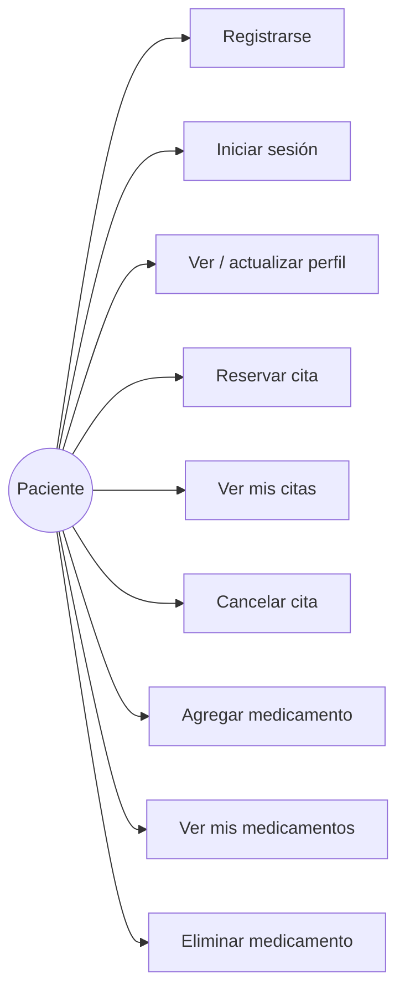
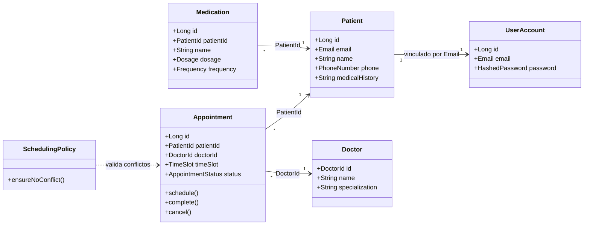
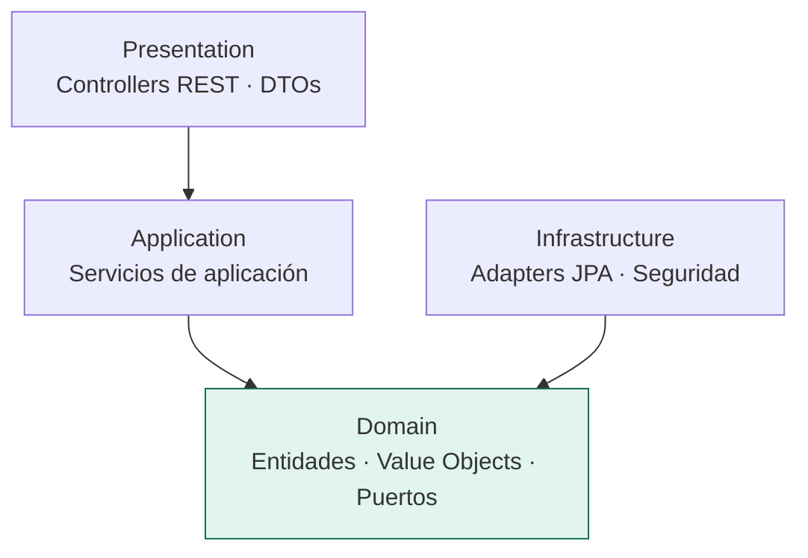
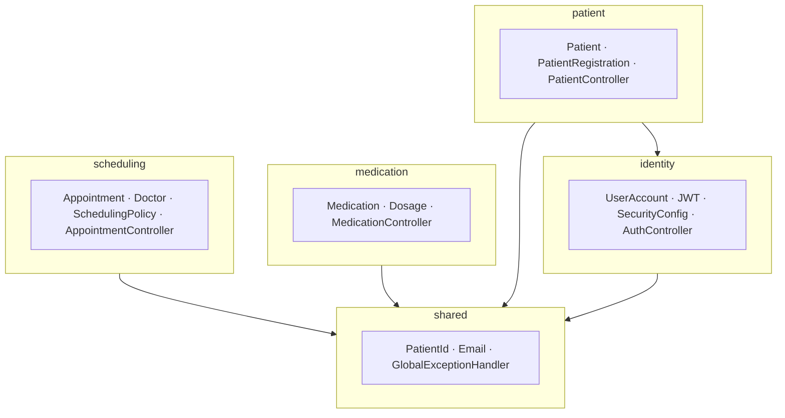
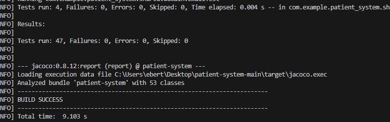
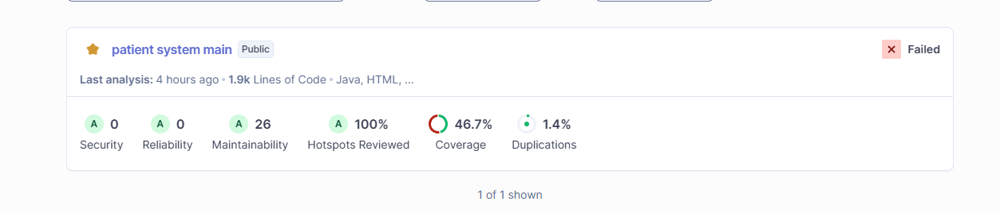
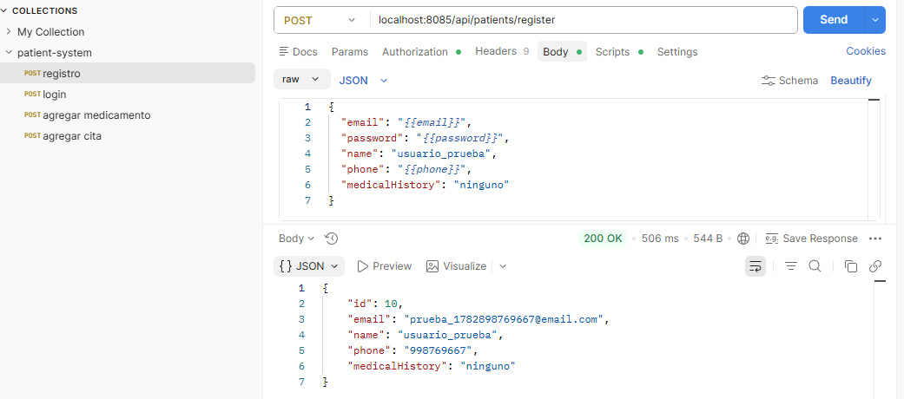
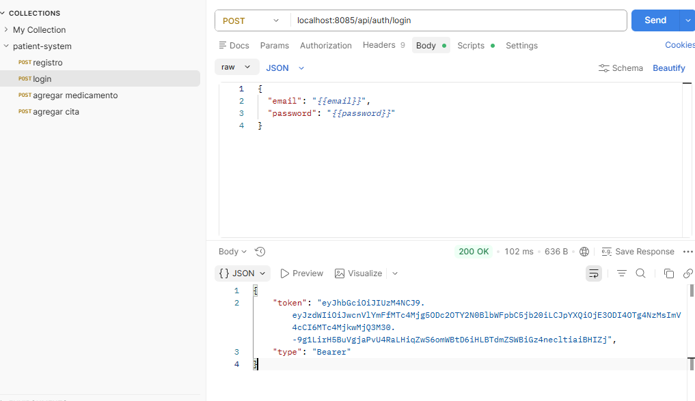
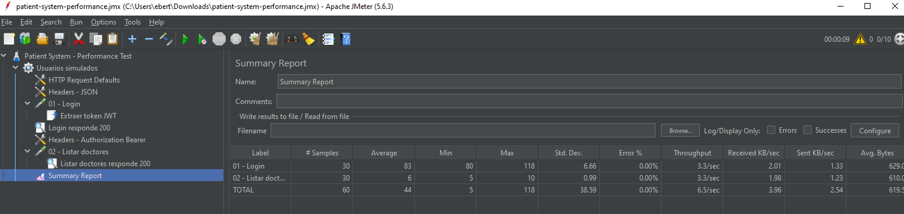
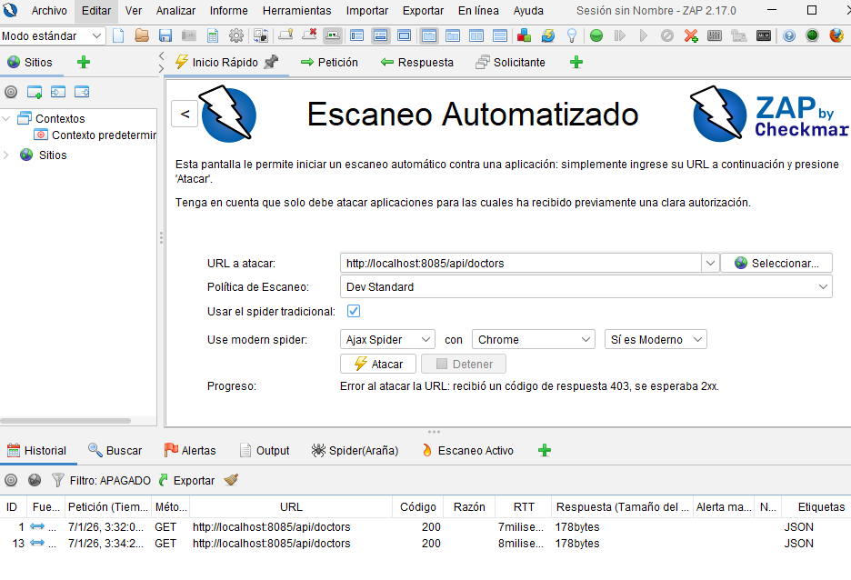

# Patient System — Sistema de Gestión de Pacientes

Sistema de gestión de pacientes rediseñado desde una arquitectura monolítica hacia una
**arquitectura modular basada en Domain-Driven Design (DDD)**, con principios SOLID,
API REST y autenticación JWT.

---

## Índice

1. [Equipo de trabajo](#1-equipo-de-trabajo)
2. [Propósito del proyecto](#2-propósito-del-proyecto)
3. [Funcionalidades (Casos de Uso)](#3-funcionalidades-casos-de-uso)
4. [Modelo de Dominio (Diagrama de Clases + Módulos)](#4-modelo-de-dominio)
5. [Visión General de Arquitectura (DDD + Paquetes)](#5-visión-general-de-arquitectura)
6. [Módulos y Servicios REST](#6-módulos-y-servicios-rest)
7. [Pipeline CI/CD](#7-pipeline-cicd)
8. [Cómo ejecutar](#8-cómo-ejecutar)

---

## 1. Equipo de trabajo

| Integrante |
|---|
| Esteban Andres Medina Chino |
| Ebert Luis Condori Casquino |


**Curso:** Ingeniería de Software — Universidad Católica San Pablo (UCSP)

---

## 2. Propósito del proyecto

Sistema para que clínicas y equipos médicos gestionen de forma segura y eficiente a sus
pacientes. Permite registrar y autenticar pacientes, administrar su perfil e historial
médico, reservar citas con doctores evitando choques de horario, y registrar los
medicamentos recetados.

El objetivo técnico del laboratorio fue **migrar gradualmente el monolito a una arquitectura
modular DDD**, reduciendo la deuda técnica, aumentando la reutilización y previniendo la
degradación de la arquitectura, aplicando además principios SOLID y TDD.

**Stack:** Java 21 · Spring Boot 3.2.5 · Spring Security (JWT) · Spring Data JPA · MySQL · Maven

---

## 3. Funcionalidades (Casos de Uso)

Funcionalidades de alto nivel desde el punto de vista del usuario (paciente):


---

## 4. Modelo de Dominio

El modelo de dominio se reparte en **4 bounded contexts (módulos)**. Cada uno tiene sus
entidades, agregados y value objects. Diagrama de clases (simplificado) de los agregados clave:



**Value Objects (se autovalidan):** `Email`, `PhoneNumber`, `Dosage`, `Frequency`,
`TimeSlot`, `HashedPassword`, `PatientId`, `DoctorId`, y el enum `AppointmentStatus`.

### Módulos

| Módulo | Propósito | Paquete |
|---|---|---|
| **Identity** | Autenticación, cuentas de usuario y credenciales | `identity/` |
| **Patient** | Perfil clínico e historial del paciente | `patient/` |
| **Scheduling** | Citas, doctores y regla de no choque de horario | `scheduling/` |
| **Medication** | Medicamentos recetados por paciente | `medication/` |
| **Shared** _(apoyo)_ | Conceptos compartidos entre módulos (`PatientId`, `Email`, manejo de errores) | `shared/` |

---

## 5. Visión General de Arquitectura

Arquitectura **DDD + Clean Architecture**: organización *package-by-bounded-context*
(un paquete por módulo) y, dentro de cada módulo, **4 capas** con la dependencia apuntando
hacia el dominio (inversión de dependencias — la "D" de SOLID).

### Capas por módulo




### Diagrama de paquetes




Estructura real de carpetas:

```text
src/main/java/com/example/patient_system
├── identity
│   ├── presentation
│   ├── application
│   ├── domain
│   └── infrastructure
├── patient
│   ├── presentation
│   ├── application
│   ├── domain
│   └── infrastructure
├── medication
│   ├── presentation
│   ├── application
│   ├── domain
│   └── infrastructure
├── scheduling
│   ├── presentation
│   ├── application
│   ├── domain
│   └── infrastructure
└── shared
    └── domain
```

---

## 6. Módulos y Servicios REST

> **Documentación interactiva (Swagger / OpenAPI):** para exponer la especificación OpenAPI
> y la UI de Swagger, agregar al `pom.xml`:
> ```xml
> <dependency>
>   <groupId>org.springdoc</groupId>
>   <artifactId>springdoc-openapi-starter-webmvc-ui</artifactId>
>   <version>2.5.0</version>
> </dependency>
> ```


Todas las rutas (excepto registro y login) requieren cabecera
`Authorization: Bearer <token>`.

### Módulo: Identity — *autenticación y emisión de tokens*

| Método | URL | Parámetros / Body | Descripción |
|---|---|---|---|
| POST | `/api/auth/login` | `{ email, password }` | Valida credenciales y devuelve un token JWT |

**Modelos clave:** `UserAccount` (agregado), `Email`, `HashedPassword`.

### Módulo: Patient — *perfil clínico del paciente*

| Método | URL | Parámetros / Body | Descripción |
|---|---|---|---|
| POST | `/api/patients/register` | `{ email, password, name, phone, medicalHistory }` | Registra paciente (crea cuenta + perfil) |
| GET | `/api/patients/{id}` | `id` (path) | Obtiene el perfil del paciente |
| PUT | `/api/patients/{id}` | `id` (path) · `{ name, phone, medicalHistory }` | Actualiza el perfil |

**Modelos clave:** `Patient` (agregado, **sin contraseña**), `PhoneNumber`. Respuesta
mediante `PatientResponse` (DTO que **no** expone el password).

### Módulo: Scheduling — *agenda de citas*

| Método | URL | Parámetros / Body | Descripción |
|---|---|---|---|
| GET | `/api/doctors` | — | Lista los doctores disponibles |
| POST | `/api/appointments` | `{ patientId, doctorId, appointmentTime, notes }` | Reserva una cita (valida conflicto de horario) |
| GET | `/api/patients/{id}/appointments` | `id` (path) | Lista las citas del paciente |
| PATCH | `/api/appointments/{id}/cancel` | `id` (path) | Cancela una cita |

**Modelos clave:** `Appointment` (agregado), `Doctor`, `TimeSlot`, `AppointmentStatus`,
servicio de dominio `SchedulingPolicy`. Un intento de doble reserva devuelve **409 Conflict**.

### Módulo: Medication — *medicamentos del paciente*

| Método | URL | Parámetros / Body | Descripción |
|---|---|---|---|
| POST | `/api/medications` | `{ patientId, name, dosage, frequency }` | Agrega un medicamento |
| GET | `/api/patients/{id}/medications` | `id` (path) | Lista los medicamentos del paciente |
| DELETE | `/api/medications/{id}` | `id` (path) | Elimina un medicamento |

**Modelos clave:** `Medication` (agregado), `Dosage`, `Frequency`. Una dosis inválida
(negativa o sin unidad) devuelve **400 Bad Request**.

---

## 7. Pipeline CI/CD


| Etapa | Herramienta | Estado |
|---|---|---|
| Construcción automática | Maven `mvn clean compile` | ✔ |
| Análisis estático | SonarQube + Maven Sonar Plugin | ✔ |
| Pruebas unitarias | JUnit 5 + JaCoCo | ✔ |
| Pruebas funcionales | Postman / Newman | ✔ |
| Pruebas de seguridad | OWASP ZAP | ✔ |
| Pruebas de performance | Apache JMeter | ✔ |
| Gestión de issues | GitHub Issues + GitHub Projects | ✔ |

---

## 7.1 Construcción automática

En esta etapa Jenkins compila el proyecto `patient-system` usando Maven.  
El objetivo es verificar que el código fuente no tenga errores de compilación antes de ejecutar las demás validaciones.

**Herramienta utilizada:** Maven

**Comando local:**

```bat
mvn -B clean compile
```

**Comando en Jenkinsfile:**

```groovy
bat 'mvn -B clean compile'
```

**Resultado esperado:**  
El proyecto compila correctamente y Jenkins muestra `BUILD SUCCESS`.

---

## 7.2 Pruebas unitarias

En esta etapa Jenkins ejecuta las pruebas unitarias con JUnit 5.  
Estas pruebas validan la lógica interna de los módulos del sistema, como `Medication`, `Scheduling`, `Patient` y `Shared`.

**Herramientas utilizadas:** JUnit 5 y JaCoCo

**Comando local:**

```bat
mvn -B test
```

**Comando en Jenkinsfile:**

```groovy
bat 'mvn -B test'
junit 'target/surefire-reports/*.xml'
```

**Resultado esperado:**  
Las pruebas terminan sin fallos. En la ejecución del pipeline se obtuvo:

```text
Tests run: 47, Failures: 0, Errors: 0, Skipped: 0
```


---

## 7.3 Análisis estático

En esta etapa Jenkins ejecuta SonarQube para analizar la calidad del código.  
Esta revisión permite identificar bugs, vulnerabilidades, code smells, duplicación y cobertura.

Antes de ejecutar esta etapa, SonarQube debe estar activo en:

```text
http://localhost:9000
```

**Herramientas utilizadas:** SonarQube y Maven Sonar Plugin

**Comando para activar SonarQube localmente:**

```bat
C:\sonarqube\bin\windows-x86-64\StartSonar.bat
```

**Comando local de análisis:**

```bat
mvn -B sonar:sonar -Dsonar.host.url=http://localhost:9000 -Dsonar.token=******
```

**Comando en Jenkinsfile:**

```groovy
bat "mvn -B sonar:sonar -Dsonar.host.url=${SONAR_HOST} -Dsonar.token=******"
```



---

## 7.4 Pruebas funcionales

En esta etapa Jenkins ejecuta una colección de Postman mediante Newman.  
Se valida que los endpoints REST funcionen correctamente.

**Flujo probado:**

```text
Registro de paciente
Login con JWT
Registro de medicamento
Registro de cita médica
```

**Herramientas utilizadas:** Postman y Newman

**Archivo utilizado:**

```text
postman/patient-system.postman_collection.json
```


**Comando en Jenkinsfile:**

```groovy
newman.cmd run "postman/patient-system.postman_collection.json"
```

**Resultado esperado:**  
Newman ejecuta todos los requests y assertions sin errores.  
En la ejecución del pipeline se obtuvo `failed: 0`.




---

## 7.5 Pruebas de performance

En esta etapa Jenkins ejecuta una prueba de rendimiento con Apache JMeter.  
El objetivo es medir tiempos de respuesta, cantidad de peticiones, promedio, máximo, mínimo y porcentaje de errores.

**Herramienta utilizada:** Apache JMeter

**Archivo utilizado:**

```text
jmeter/patient-system-performance.jmx
```


**Comando en Jenkinsfile:**

```groovy
"C:\\apache-jmeter-5.6.3\\bin\\jmeter.bat" -n -t "jmeter\\patient-system-performance.jmx" -l "target\\jmeter\\results.jtl" -e -o "target\\jmeter\\report"
```

**Resultado esperado:**  
JMeter genera un archivo de resultados y un reporte HTML en:

```text
target/jmeter/report
```

En la ejecución del pipeline se obtuvo:

```text
Err: 0 (0.00%)
```


---

## 7.6 Pruebas de seguridad

En esta etapa Jenkins ejecuta un escaneo básico de seguridad con OWASP ZAP.  
El objetivo es analizar la API en busca de posibles vulnerabilidades comunes.

**Herramienta utilizada:** OWASP ZAP

**URL analizada:**

```text
http://localhost:8085/api/doctors
```

**Comando en Jenkinsfile:**

```groovy
pushd "C:\\Program Files\\ZAP\\Zed Attack Proxy"

call zap.bat -cmd -quickurl http://localhost:8085/api/doctors -quickout "%WORKSPACE%\\target\\zap\\zap-report.html" -quickprogress

popd
```

**Resultado esperado:**  
OWASP ZAP ejecuta el escaneo y genera el reporte:

```text
target/zap/zap-report.html
```


---


### Mapa de Issues → Módulos

| Issues | Entregable |
|---|---|
| #19 | Estructura modular de paquetes (esqueleto) |
| #20 | Value Object `PatientId` en `shared/` |
| #25 | Módulo **Medication** (DDD + API REST) |
| #26 | Módulo **Scheduling** (DDD + API REST) |
| #27 | Separación **Identity / Patient** + corrección de fuga de password |
| #28 | Presentación: controllers REST por módulo, JWT y desacople |
| #29 | Añadir archivo Postman, pruebas funcionales |
| #30 | Añadir archivo Jmeter, pruebas de performance |
| #31 | Implemntar pruebas de serguridad OWASP ZAP archivo Jenkinsfile|

---

## 8. Cómo ejecutar

**Requisitos:** Java 21, Maven, MySQL (XAMPP).

1. Arrancar MySQL en XAMPP.
2. Configurar `src/main/resources/application.properties` (base de datos y `jwt.secret`).
3. Ejecutar:
   ```bash
   mvn spring-boot:run
   ```
4. La API queda en `http://localhost:8085`.

**Primer uso:**
```bash
# Registrar
POST /api/patients/register  { "email":"...", "password":"...", "name":"...", "phone":"...", "medicalHistory":"..." }
# Login (devuelve token)
POST /api/auth/login  { "email":"...", "password":"..." }
# Usar el token en las demás rutas: Authorization: Bearer <token>
```
