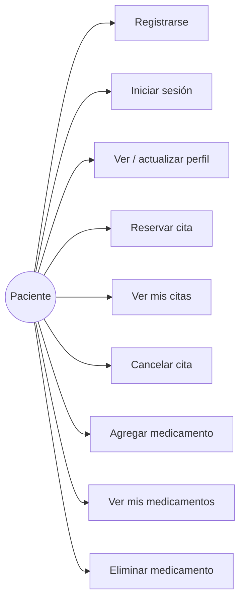
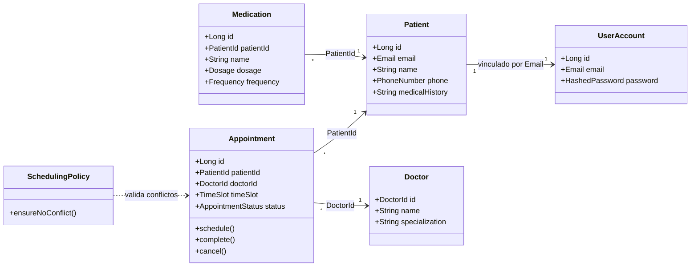
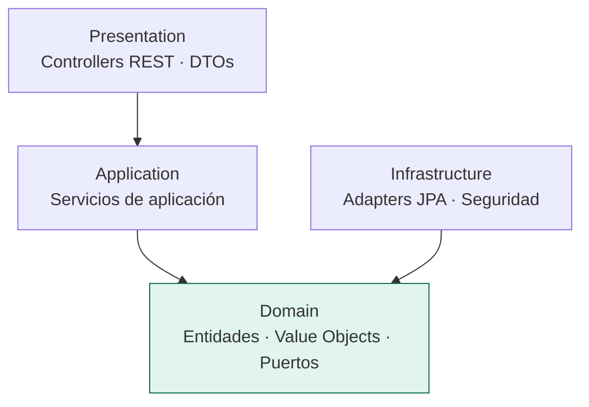
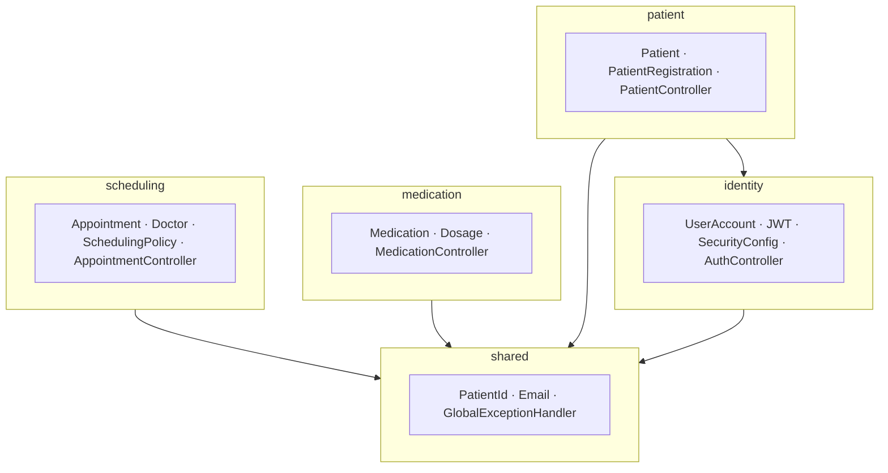

# Patient System — Sistema de Gestión de Pacientes

Sistema de gestión de pacientes rediseñado desde una arquitectura monolítica hacia una
**arquitectura modular basada en Domain-Driven Design (DDD)**, con principios SOLID,
API REST y autenticación JWT.

---

## Índice

1. [Equipo de trabajo](#1-equipo-de-trabajo)
2. [Propósito del proyecto](#2-propósito-del-proyecto)
3. [Funcionalidades (Casos de Uso)](#3-funcionalidades-casos-de-uso)
4. [Modelo de Dominio (Diagrama de Clases + Módulos)](#4-modelo-de-dominio)
5. [Visión General de Arquitectura (DDD + Paquetes)](#5-visión-general-de-arquitectura)
6. [Módulos y Servicios REST](#6-módulos-y-servicios-rest)
7. [Pipeline CI/CD](#7-pipeline-cicd)
8. [Cómo ejecutar](#8-cómo-ejecutar)

---

## 1. Equipo de trabajo

| Integrante |
|---|
| Esteban Andres Medina Chino |
| Ebert Luis Condori Casquino |


**Curso:** Ingeniería de Software — Universidad Católica San Pablo (UCSP)

---

## 2. Propósito del proyecto

Sistema para que clínicas y equipos médicos gestionen de forma segura y eficiente a sus
pacientes. Permite registrar y autenticar pacientes, administrar su perfil e historial
médico, reservar citas con doctores evitando choques de horario, y registrar los
medicamentos recetados.

El objetivo técnico del laboratorio fue **migrar gradualmente el monolito a una arquitectura
modular DDD**, reduciendo la deuda técnica, aumentando la reutilización y previniendo la
degradación de la arquitectura, aplicando además principios SOLID y TDD.

**Stack:** Java 21 · Spring Boot 3.2.5 · Spring Security (JWT) · Spring Data JPA · MySQL · Maven

---

## 3. Funcionalidades (Casos de Uso)

Funcionalidades de alto nivel desde el punto de vista del usuario (paciente):


---

## 4. Modelo de Dominio

El modelo de dominio se reparte en **4 bounded contexts (módulos)**. Cada uno tiene sus
entidades, agregados y value objects. Diagrama de clases (simplificado) de los agregados clave:



**Value Objects (se autovalidan):** `Email`, `PhoneNumber`, `Dosage`, `Frequency`,
`TimeSlot`, `HashedPassword`, `PatientId`, `DoctorId`, y el enum `AppointmentStatus`.

### Módulos

| Módulo | Propósito | Paquete |
|---|---|---|
| **Identity** | Autenticación, cuentas de usuario y credenciales | `identity/` |
| **Patient** | Perfil clínico e historial del paciente | `patient/` |
| **Scheduling** | Citas, doctores y regla de no choque de horario | `scheduling/` |
| **Medication** | Medicamentos recetados por paciente | `medication/` |
| **Shared** _(apoyo)_ | Conceptos compartidos entre módulos (`PatientId`, `Email`, manejo de errores) | `shared/` |

---

## 5. Visión General de Arquitectura

Arquitectura **DDD + Clean Architecture**: organización *package-by-bounded-context*
(un paquete por módulo) y, dentro de cada módulo, **4 capas** con la dependencia apuntando
hacia el dominio (inversión de dependencias — la "D" de SOLID).

### Capas por módulo



> La interfaz del repositorio vive en **Domain** (puro, sin Spring/JPA) y su implementación
> en **Infrastructure**. Por eso el dominio se prueba con dobles en memoria, sin base de datos.

### Diagrama de paquetes



Estructura real de carpetas:

```text
src/main/java/com/example/patient_system
├── identity
│   ├── presentation
│   ├── application
│   ├── domain
│   └── infrastructure
├── patient
│   ├── presentation
│   ├── application
│   ├── domain
│   └── infrastructure
├── medication
│   ├── presentation
│   ├── application
│   ├── domain
│   └── infrastructure
├── scheduling
│   ├── presentation
│   ├── application
│   ├── domain
│   └── infrastructure
└── shared
    └── domain
```

---

## 6. Módulos y Servicios REST

> **Documentación interactiva (Swagger / OpenAPI):** para exponer la especificación OpenAPI
> y la UI de Swagger, agregar al `pom.xml`:
> ```xml
> <dependency>
>   <groupId>org.springdoc</groupId>
>   <artifactId>springdoc-openapi-starter-webmvc-ui</artifactId>
>   <version>2.5.0</version>
> </dependency>
> ```
> y permitir en `SecurityConfig` las rutas `"/swagger-ui/**"` y `"/v3/api-docs/**"`.
> La UI queda en `http://localhost:8085/swagger-ui.html` y la spec en `/v3/api-docs`.

Todas las rutas (excepto registro y login) requieren cabecera
`Authorization: Bearer <token>`.

### Módulo: Identity — *autenticación y emisión de tokens*

| Método | URL | Parámetros / Body | Descripción |
|---|---|---|---|
| POST | `/api/auth/login` | `{ email, password }` | Valida credenciales y devuelve un token JWT |

**Modelos clave:** `UserAccount` (agregado), `Email`, `HashedPassword`.

### Módulo: Patient — *perfil clínico del paciente*

| Método | URL | Parámetros / Body | Descripción |
|---|---|---|---|
| POST | `/api/patients/register` | `{ email, password, name, phone, medicalHistory }` | Registra paciente (crea cuenta + perfil) |
| GET | `/api/patients/{id}` | `id` (path) | Obtiene el perfil del paciente |
| PUT | `/api/patients/{id}` | `id` (path) · `{ name, phone, medicalHistory }` | Actualiza el perfil |

**Modelos clave:** `Patient` (agregado, **sin contraseña**), `PhoneNumber`. Respuesta
mediante `PatientResponse` (DTO que **no** expone el password).

### Módulo: Scheduling — *agenda de citas*

| Método | URL | Parámetros / Body | Descripción |
|---|---|---|---|
| GET | `/api/doctors` | — | Lista los doctores disponibles |
| POST | `/api/appointments` | `{ patientId, doctorId, appointmentTime, notes }` | Reserva una cita (valida conflicto de horario) |
| GET | `/api/patients/{id}/appointments` | `id` (path) | Lista las citas del paciente |
| PATCH | `/api/appointments/{id}/cancel` | `id` (path) | Cancela una cita |

**Modelos clave:** `Appointment` (agregado), `Doctor`, `TimeSlot`, `AppointmentStatus`,
servicio de dominio `SchedulingPolicy`. Un intento de doble reserva devuelve **409 Conflict**.

### Módulo: Medication — *medicamentos del paciente*

| Método | URL | Parámetros / Body | Descripción |
|---|---|---|---|
| POST | `/api/medications` | `{ patientId, name, dosage, frequency }` | Agrega un medicamento |
| GET | `/api/patients/{id}/medications` | `id` (path) | Lista los medicamentos del paciente |
| DELETE | `/api/medications/{id}` | `id` (path) | Elimina un medicamento |

**Modelos clave:** `Medication` (agregado), `Dosage`, `Frequency`. Una dosis inválida
(negativa o sin unidad) devuelve **400 Bad Request**.

---

## 7. Pipeline CI/CD

Etapas de integración y entrega continua. _[Marca con ✔ lo implementado y con ⏳ lo planeado
según lo que tu equipo haya configurado.]_

| Etapa | Herramienta | Estado |
|---|---|---|
| Construcción automática | Maven (`mvn clean package`) | ✔ |
| Análisis estático | SonarQube (Community 9.9) + SonarScanner | ✔ |
| Pruebas unitarias | JUnit 5 (+ JaCoCo cobertura) | ✔ |
| Pruebas funcionales | Postman / Newman (endpoints REST) | ✔ |
| Pruebas de seguridad | OWASP Dependency-Check / ZAP | ✔ |
| Pruebas de performance | Apache JMeter / Gatling | ✔ |
| Gestión de issues | GitHub Issues + GitHub Projects | ✔ |

### Detalle por etapa

**Construcción automática.** `mvn clean package` compila los 4 módulos y genera un JAR
autoejecutable con Tomcat embebido.

y esto

**Análisis estático.** SonarQube inspecciona code smells, bugs y vulnerabilities. En el
laboratorio previo se corrigieron: código comentado muerto, literales duplicados en la
configuración de seguridad, y bugs de validación (teléfono y dosis negativos), que en el
rediseño quedaron encapsulados en value objects autovalidados.

**Pruebas unitarias (TDD).** Cada módulo tiene pruebas de dominio y de servicio con dobles
en memoria (sin Spring ni BD): `DosageTest`, `TimeSlotTest`, `AppointmentTest`,
`SchedulingPolicyTest`, `EmailTest`, `PhoneNumberTest`, `PatientRegistrationServiceTest`, etc.

**Pruebas funcionales.** Flujo completo verificado con Postman contra los endpoints REST:
registro → login (token JWT) → operaciones de cada módulo, incluyendo casos de error
(401 credenciales inválidas, 403 sin token, 409 conflicto de cita).

**Pruebas de seguridad / performance.** _[Describir aquí lo que el equipo haya realizado
o planee: análisis de dependencias vulnerables, pruebas de carga sobre los endpoints, etc.]_

**Gestión de issues.** Las tareas de migración se gestionaron como GitHub Issues, agrupadas
por módulo, con etiquetas `redesign` / `enhancement`, y los commits se enlazaron con `Fix #n`.

Ejemplo de workflow (GitHub Actions) — `.github/workflows/ci.yml`:

```yaml
name: CI
on: [push, pull_request]
jobs:
  build-and-test:
    runs-on: ubuntu-latest
    steps:
      - uses: actions/checkout@v4
      - uses: actions/setup-java@v4
        with:
          distribution: temurin
          java-version: '21'
      - name: Construir y probar
        run: mvn clean verify
      # - name: Análisis SonarQube
      #   run: mvn sonar:sonar -Dsonar.host.url=$SONAR_URL -Dsonar.login=$SONAR_TOKEN
```

### Mapa de Issues → Módulos

| Issues | Entregable |
|---|---|
| #1 | Estructura modular de paquetes (esqueleto) |
| #2 | Value Object `PatientId` en `shared/` |
| #3–#6 | Módulo **Medication** (DDD + API REST) |
| #7–#11 | Módulo **Scheduling** (DDD + API REST) |
| #12–#15 | Separación **Identity / Patient** + corrección de fuga de password |
| #16–#18 | Presentación: controllers REST por módulo, JWT y desacople |

---

## 8. Cómo ejecutar

**Requisitos:** Java 21, Maven, MySQL (XAMPP).

1. Arrancar MySQL en XAMPP.
2. Configurar `src/main/resources/application.properties` (base de datos y `jwt.secret`).
3. Ejecutar:
   ```bash
   mvn spring-boot:run
   ```
4. La API queda en `http://localhost:8085`.

**Primer uso:**
```bash
# Registrar
POST /api/patients/register  { "email":"...", "password":"...", "name":"...", "phone":"...", "medicalHistory":"..." }
# Login (devuelve token)
POST /api/auth/login  { "email":"...", "password":"..." }
# Usar el token en las demás rutas: Authorization: Bearer <token>
```
